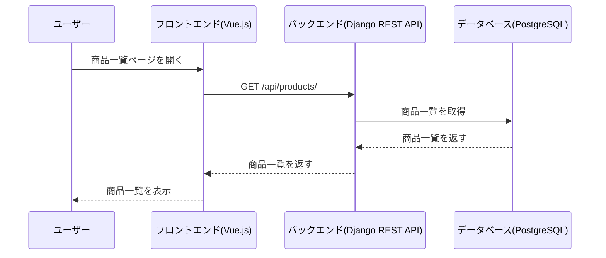
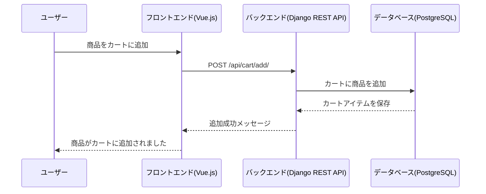
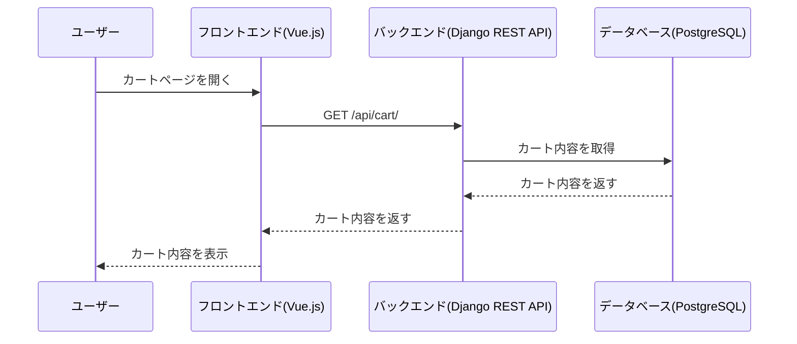
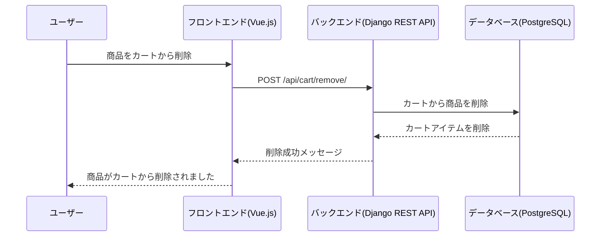
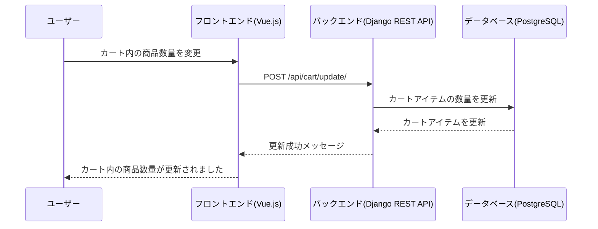

# ECサイトの機能設計書

## 商品一覧の表示

```mermaid
sequenceDiagram
    participant User as ユーザー
    participant VueApp as フロントエンド(Vue.js)
    participant API as バックエンド(Django REST API)
    participant DB as データベース(PostgreSQL)

    User->>VueApp: 商品一覧ページを開く
    VueApp->>API: GET /api/products/
    API->>DB: 商品一覧を取得
    DB-->>API: 商品一覧を返す
    API-->>VueApp: 商品一覧を返す
    VueApp-->>User: 商品一覧を表示
```

## 商品をカートに追加

```mermaid
sequenceDiagram
    participant User as ユーザー
    participant VueApp as フロントエンド(Vue.js)
    participant API as バックエンド(Django REST API)
    participant DB as データベース(PostgreSQL)

    User->>VueApp: 商品をカートに追加
    VueApp->>API: POST /api/cart/add/
    API->>DB: カートに商品を追加
    DB-->>API: カートアイテムを保存
    API-->>VueApp: 追加成功メッセージ
    VueApp-->>User: 商品がカートに追加されました
```

## カートの表示

```mermaid
sequenceDiagram
    participant User as ユーザー
    participant VueApp as フロントエンド(Vue.js)
    participant API as バックエンド(Django REST API)
    participant DB as データベース(PostgreSQL)

    User->>VueApp: カートページを開く
    VueApp->>API: GET /api/cart/
    API->>DB: カート内容を取得
    DB-->>API: カート内容を返す
    API-->>VueApp: カート内容を返す
    VueApp-->>User: カート内容を表示
```

## 商品をカートから削除

```mermaid
sequenceDiagram
    participant User as ユーザー
    participant VueApp as フロントエンド(Vue.js)
    participant API as バックエンド(Django REST API)
    participant DB as データベース(PostgreSQL)

    User->>VueApp: 商品をカートから削除
    VueApp->>API: POST /api/cart/remove/
    API->>DB: カートから商品を削除
    DB-->>API: カートアイテムを削除
    API-->>VueApp: 削除成功メッセージ
    VueApp-->>User: 商品がカートから削除されました
```

## カート内の商品数量を更新

```mermaid
sequenceDiagram
    participant User as ユーザー
    participant VueApp as フロントエンド(Vue.js)
    participant API as バックエンド(Django REST API)
    participant DB as データベース(PostgreSQL)

    User->>VueApp: カート内の商品数量を変更
    VueApp->>API: POST /api/cart/update/
    API->>DB: カートアイテムの数量を更新
    DB-->>API: カートアイテムを更新
    API-->>VueApp: 更新成功メッセージ
    VueApp-->>User: カート内の商品数量が更新されました
```
