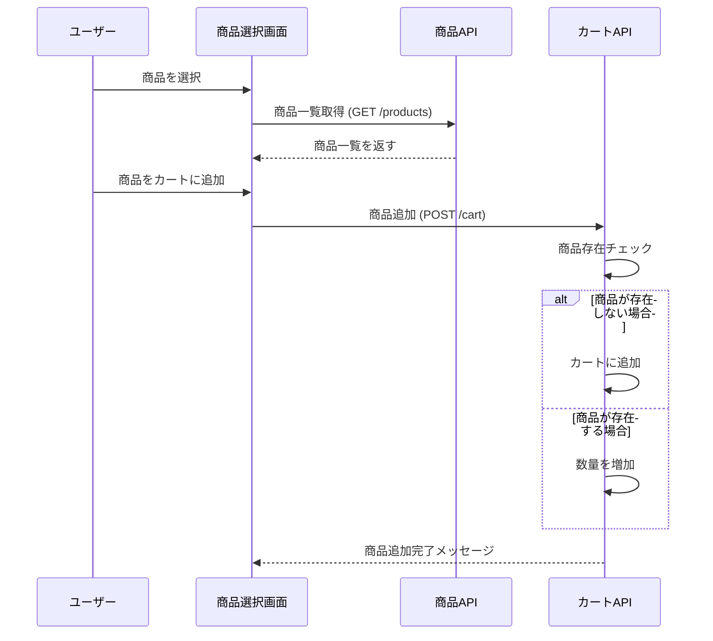
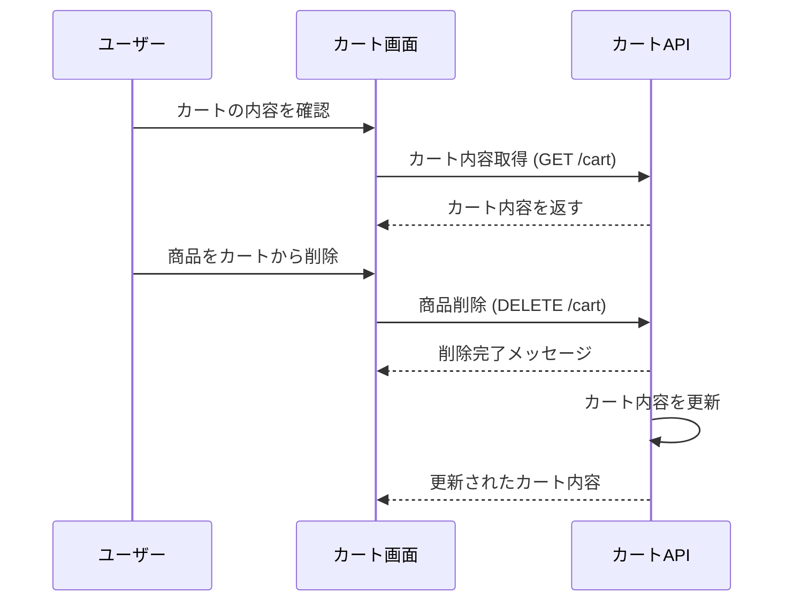
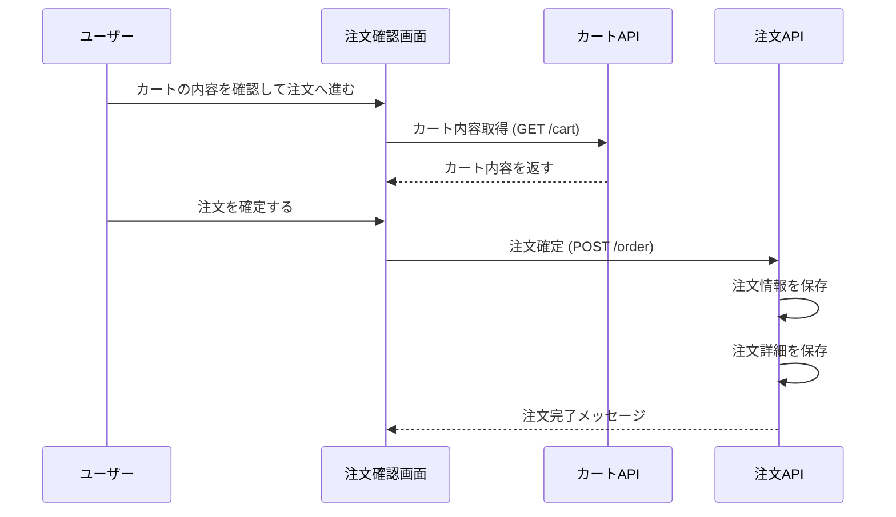
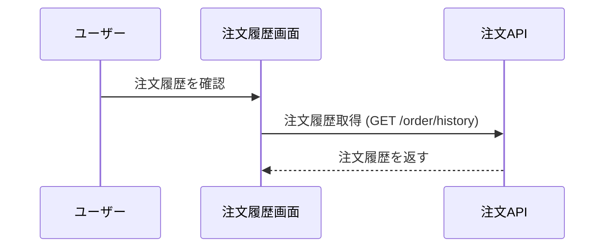

# 機能設計書

### 1. 商品選択からカート追加までのシーケンス

```mermaid
sequenceDiagram
    participant ユーザー
    participant 商品選択画面
    participant 商品API
    participant カートAPI

    ユーザー ->> 商品選択画面: 商品を選択
    商品選択画面 ->> 商品API: 商品一覧取得 (GET /products)
    商品API -->> 商品選択画面: 商品一覧を返す
    ユーザー ->> 商品選択画面: 商品をカートに追加
    商品選択画面 ->> カートAPI: 商品追加 (POST /cart)
    カートAPI ->> カートAPI: 商品存在チェック
    alt 商品が存在しない場合
        カートAPI ->> カートAPI: カートに追加
    else 商品が存在する場合
        カートAPI ->> カートAPI: 数量を増加
    end
    カートAPI -->> 商品選択画面: 商品追加完了メッセージ
```

### 2. カート内容の確認および削除のシーケンス

```mermaid
sequenceDiagram
    participant ユーザー
    participant カート画面
    participant カートAPI

    ユーザー ->> カート画面: カートの内容を確認
    カート画面 ->> カートAPI: カート内容取得 (GET /cart)
    カートAPI -->> カート画面: カート内容を返す
    ユーザー ->> カート画面: 商品をカートから削除
    カート画面 ->> カートAPI: 商品削除 (DELETE /cart)
    カートAPI -->> カート画面: 削除完了メッセージ
    カートAPI ->> カートAPI: カート内容を更新
    カートAPI -->> カート画面: 更新されたカート内容
```

### 3. 注文確認から注文完了までのシーケンス

```mermaid
sequenceDiagram
    participant ユーザー
    participant 注文確認画面
    participant カートAPI
    participant 注文API

    ユーザー ->> 注文確認画面: カートの内容を確認して注文へ進む
    注文確認画面 ->> カートAPI: カート内容取得 (GET /cart)
    カートAPI -->> 注文確認画面: カート内容を返す
    ユーザー ->> 注文確認画面: 注文を確定する
    注文確認画面 ->> 注文API: 注文確定 (POST /order)
    注文API ->> 注文API: 注文情報を保存
    注文API ->> 注文API: 注文詳細を保存
    注文API -->> 注文確認画面: 注文完了メッセージ
```

### 4. 注文履歴の確認シーケンス

```mermaid
sequenceDiagram
    participant ユーザー
    participant 注文履歴画面
    participant 注文API

    ユーザー ->> 注文履歴画面: 注文履歴を確認
    注文履歴画面 ->> 注文API: 注文履歴取得 (GET /order/history)
    注文API -->> 注文履歴画面: 注文履歴を返す
```
